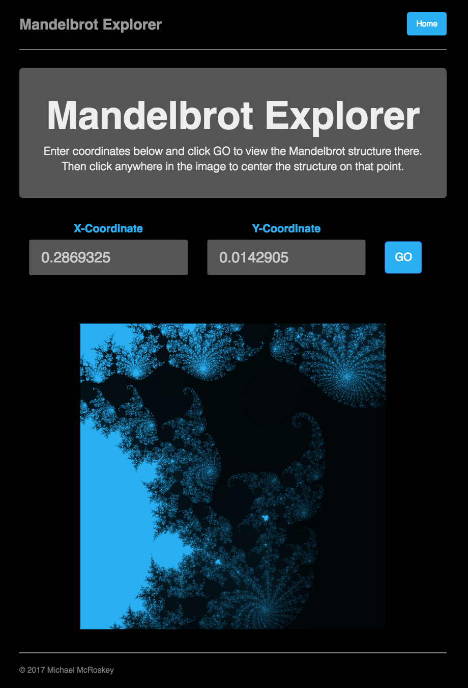

# Mandelbrot Explorer

A project by Michael McRoskey

----
## Overview
Mandelbrot Explorer is an interface which let's you interact with images of the Mandelbrot set generated with C code. It runs on a local server via the [SimpleHTTPServer](https://docs.python.org/2/library/simplehttpserver.html) module in Python.

----
## Files
1. **`server.py`**: This contains the script to process and handle server requests on `localhost:9001`. It loads `index.html` as the default page in a web browser.
2. **`Makefile`**: Running the command `make` in this directory will properly compile `mandel.c`
3. **`mandel.c`**: Generates an image of Mandelbrot structure at given points
4. **`bitmap.c`**: Bitmap struct file
5. **`bitmap.h`**: Header file for bitmap
6. **`index.html`**: HTML for web page
7. **`style.css`**: CSS styling for web page
8. images
    * **`example.png`**: example photo of interface
9. **`requirements.txt`**: Python environment requirements
10. **`README.md`**

----
## Usage
1. Run `$ make` to build the executables.
2. Run `$ python server.py` to run the Python server on `localhost:9001`
3. In a web browser, navigate to `http://localhost:9001/`.
4. Input x and y coordinates if desired and click GO to generate Mandelbrot image at that location.
5. Click on the image the center the image on that point. `./mandel` will generate a new image and load it to the browser.

----
## Known Issues

1. Zoom is not enabled at this time.

----